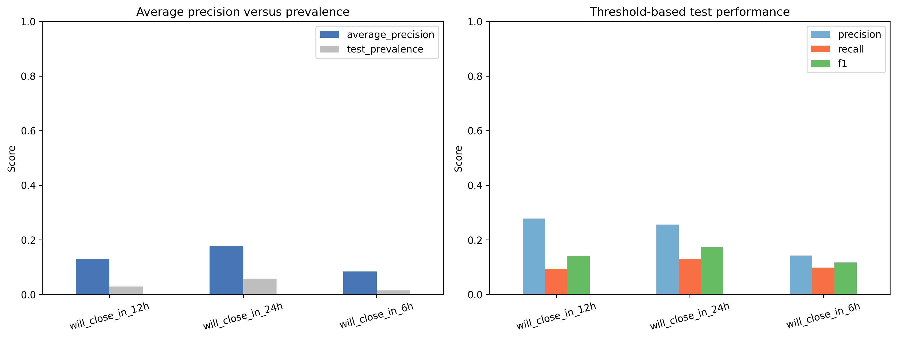

# I-80 Donner Pass Closure Risk

A reproducible machine-learning analysis of winter road-closure risk on
Interstate 80 near Donner Pass. The project combines manually reviewed CHP
closure records with hourly weather observations and ranks the likelihood that
the road will be closed at any point during the next 24 hours.

The public repository contains the research workflow, evaluation outputs, and
source datasets. The production AWS Lambda inference pipeline and trained model
artifact are maintained separately in a private backend repository.

## Results at a glance

The selected model is a constrained random forest evaluated with chronological
winter splits. Model selection used the 2023–2024 validation winter; the final
2024–2025 winter remained untouched until evaluation.

| Metric | Held-out test result |
|---|---:|
| Average precision | 0.259 |
| ROC AUC | 0.769 |
| Brier score | 0.053 |
| Positive-hour prevalence | 5.8% |

Risk thresholds were frozen before final testing. The observed rate of being
within 24 hours of a closure increased monotonically across all four levels:

| Risk level | Model score | Observed test rate | Lift vs. baseline |
|---|---:|---:|---:|
| Low | Below 6.5% | 2.8% | 0.49× |
| Medium | 6.5%–15.1% | 9.0% | 1.55× |
| High | 15.1%–50.5% | 13.9% | 2.39× |
| Extreme | 50.5% or higher | 43.6% | 7.50× |

“Extreme” is a selective risk category, not a guarantee. Of the 14 test-winter
closures with sufficient weather history, 11 received at least one High or
Extreme warning in the preceding 24 hours.



## Problem definition

For every eligible winter hour, the target asks whether I-80 is confirmed
closed during any exact hourly timestamp from `t + 1` through `t + 24`. A row
is negative only when the complete future window is observed and open.
Uncertain or incomplete windows are excluded unless they contain a confirmed
closure.

The model uses only information available at scoring time:

- snowfall, precipitation, pressure, cloud cover, wind, temperature, snow
  depth, humidity, and weather code;
- cyclic month and hour terms; and
- trailing 6-hour and 24-hour weather summaries.

Closure labels, future weather, outcome fields, and raw winter identifiers are
not used as predictors. Rolling features require consecutive hourly history so
data gaps are never silently bridged.

## Validation design

- Training: winters 2016–2017 through 2022–2023
- Validation and model selection: winter 2023–2024
- Final held-out test: winter 2024–2025
- Excluded: incomplete winter 2025–2026

Logistic regression, random forest, and histogram gradient boosting were
compared using validation average precision. Risk-category thresholds were
tuned on validation results, checked for monotonic observed risk and minimum
category size, then frozen before final testing.

## Repository structure

```text
main/
├── data/                    # Curated closure and weather datasets
├── notebooks/
│   ├── 01_dataset_construction.ipynb
│   ├── 02_eda.ipynb
│   └── 03_modeling.ipynb
├── outputs/
│   ├── eda/                 # Tables and figures from exploratory analysis
│   └── modeling/            # Held-out metrics, predictions, and figures
└── utils.py                 # Reusable interval and target-building helpers
weather/
└── historical_weather_api.py
facebook/                    # Source records and supporting exploratory work
requirements.txt
```

Generated deployment packages, credentials, model binaries, and production
backend code are intentionally excluded from this public repository.

## Reproduce the analysis

Python 3.11 or newer is recommended.

```bash
git clone git@github.com:PinkyHuddy/road_project.git
cd road_project
python3 -m venv .venv
source .venv/bin/activate
python3 -m pip install --upgrade pip
python3 -m pip install -r requirements.txt
jupyter lab
```

Run the notebooks in order:

1. `main/notebooks/01_dataset_construction.ipynb`
2. `main/notebooks/02_eda.ipynb`
3. `main/notebooks/03_modeling.ipynb`

The first notebook rebuilds the forecast-target dataset; the modeling notebook
recreates the trained artifact locally. Those generated files are not committed
to the public repository.

To refresh the historical weather source directly:

```bash
python weather/historical_weather_api.py
```

## Data provenance

Closure and reopening times were manually reviewed from CHP-derived source
records. Weather observations come from the Open-Meteo Historical Weather API
for the Donner Summit corridor. The project retains October through May and
uses UTC internally for hourly alignment.

## Limitations

- This is a statistical risk-ranking model, not a causal model or safety
  guarantee.
- CHP post times may lag the physical start of a closure.
- Crashes, traffic, road treatment, and operational decisions are not fully
  represented.
- The reported performance comes from one held-out winter and should be
  monitored across future winters.
- Live weather feeds can differ from the historical archive used for training,
  creating deployment distribution shift.

Always rely on official Caltrans and CHP guidance for travel decisions.
